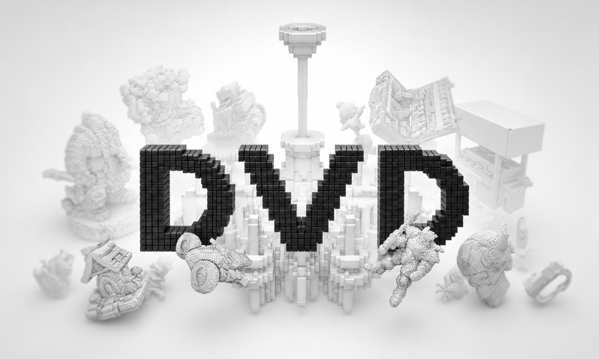

# DVD: Discrete Voxel Diffusion for 3D Generation and Editing
<a href="https://arxiv.org/abs/2605.07971"></a>
<a href="https://huggingface.co/Zhengrui/dvd"></a>
<a href="LICENSE"></a>

**TL;DR**: A discrete diffusion based pipeline for generating, assessing and editing voxels, without thresholding artifacts.


DVD provides a integrated pipeline for generating, assessing and editing the sparse voxels. The generated voxels can be used as anchors for [SLAT]((https://github.com/microsoft/TRELLIS)) 3D generation pipelines. The pipeline is intentionally split into two stages:

- DVD generates or edits a pure `64^3` voxel grid.
- We leverage [TRELLIS](https://github.com/microsoft/TRELLIS) stage 2 to produce the final 3D asset formats, including mesh and 3D Gaussian outputs.

This repository supports image-conditioned generation, text-conditioned
generation, image-conditioned voxel editing, text-conditioned voxel editing,
command-line examples, Python APIs, and local Gradio demos.


## 🛠️ Installation

Install dependencies required by [TRELLIS](https://github.com/microsoft/TRELLIS).

Install [pytorch3d](https://pytorch3d.org/).

For the default fast path used by the examples:

```bash
export SPCONV_ALGO=native
export ATTN_BACKEND=flash_attn
```

## 📦 Pretrained Models

Download the DVD checkpoints and place them under `ckpts/`, or load them from a
Hugging Face model repository with `from_pretrained`.

| Model | Link | Expected files |
| --- | --- | --- |
| DVD image generation | https://huggingface.co/Zhengrui/dvd | `dvd_img.json`, `dvd_img.safetensors` |
| DVD image editing | https://huggingface.co/Zhengrui/dvd | `dvd_img_BSP_ft.json`, `dvd_img_BSP_ft.safetensors` |
| DVD text generation | https://huggingface.co/Zhengrui/dvd | `dvd_text.json`, `dvd_text.safetensors` |
| DVD text editing | https://huggingface.co/Zhengrui/dvd | `dvd_text_BSP_ft.json`, `dvd_text_BSP_ft.safetensors` |
| TRELLIS image stage 2 | https://huggingface.co/microsoft/TRELLIS-image-large | loaded by `TrellisImageTo3DPipeline` |
| TRELLIS text stage 2 | https://huggingface.co/microsoft/TRELLIS-text-large | loaded by `TrellisTextTo3DPipeline` |

The DVD pipelines expect the default filenames above. 

## 🚀 Quick Start 

### Python API

```python
from PIL import Image
from dvd import (
    DVDImageToVoxelPipeline,
    TrellisImageTo3DPipeline,
    export_cubified_voxels,
    run_image_stage2_from_dvd_voxels,
)
from trellis.utils import postprocessing_utils

image = Image.open("assets/example_image/T.png")

# If you have the weights locally
# dvd = DVDImageToVoxelPipeline.from_files(
#     "ckpts/dvd_img.json",
#     "ckpts/dvd_img.safetensors",
#     device="cuda",
# )

# Or load with from_pretrained
dvd = DVDImageToVoxelPipeline.from_pretrained('Zhengrui/dvd', variant="base", device="cuda")

voxels = dvd.sample_voxels(image, seed=42, steps=256)

export_cubified_voxels(voxels, "example_results/T_dvd_voxels.glb")

trellis = TrellisImageTo3DPipeline.from_pretrained("microsoft/TRELLIS-image-large")
trellis.cuda()
outputs = run_image_stage2_from_dvd_voxels(trellis, image, voxels, seed=42)

glb = postprocessing_utils.to_glb(outputs["gaussian"][0], outputs["mesh"][0])
glb.export("example_results/T.glb")
```

For Hugging Face loading:

```python
from dvd import DVDImageToVoxelPipeline, DVDTextToVoxelPipeline

repo_id = "Zhengrui/dvd"

image_dvd = DVDImageToVoxelPipeline.from_pretrained(repo_id, variant="base", device="cuda")
image_edit_dvd = DVDImageToVoxelPipeline.from_pretrained(repo_id, variant="bsp", device="cuda")

text_dvd = DVDTextToVoxelPipeline.from_pretrained(repo_id, variant="base", device="cuda")
text_edit_dvd = DVDTextToVoxelPipeline.from_pretrained(repo_id, variant="bsp", device="cuda")
```

### Command-Line Examples

Image-conditioned generation:

```bash
python examples_dvd_image_generation_api.py \
  --image assets/example_image/T.png \
  --dvd-config ckpts/dvd_img.json \
  --dvd-checkpoint ckpts/dvd_img.safetensors \
  --output-dir example_results
```

Text-conditioned generation:

```bash
python examples_dvd_text_generation_api.py \
  --prompt "A small helper robot with a round body, sky-blue paint, screen face, and tiny tool arms." \
  --name robot \
  --dvd-config ckpts/dvd_text.json \
  --dvd-checkpoint ckpts/dvd_text.safetensors \
  --output-dir example_results
```

For editing, we provide a minima example in `example_edit.ipynb`. We recommend to launch apps for straightforward editing, check **Gradio Demos**.

Image-conditioned editing:

```bash
python examples_dvd_image_editing_api.py \
  --target-image assets/example_image_edit/flower_rm.png \
  --voxel-coords assets/example_voxel_edit/voxel64_typical_building_mushroom_dis.npy \
  --dvd-config ckpts/dvd_img_BSP_ft.json \
  --dvd-checkpoint ckpts/dvd_img_BSP_ft.safetensors \
  --output-dir example_results
```


Text-conditioned editing:

```bash
python examples_dvd_text_editing_api.py \
  --prompt "A mushroom house with a large wizard hat roof." \
  --voxel-coords assets/example_voxel_edit/voxel64_typical_building_mushroom_dis.npy \
  --dvd-config ckpts/dvd_text_BSP_ft.json \
  --dvd-checkpoint ckpts/dvd_text_BSP_ft.safetensors \
  --output-dir example_results \
  --edit-y 28 64 \
  --edit-z 0 64
```

Add `--skip-stage2` in the text examples if you only want to save the DVD voxel
`.npy` and cubified voxel `.glb`.

### Gradio Demos

Image generation and editing:

```bash
python app_dvd_image.py 
```

Text generation and editing:

```bash
python app_dvd_text.py 
```

For Hugging Face Spaces or local `from_pretrained` loading, set:

```bash
export DVD_MODEL_REPO=Zhengrui/dvd
```

## ❗ Voxel Convention

DVD stores and saves voxels in DVD convention:

```text
samples: [B, D, H, W]
coords:  [N, 4] as [batch, x, y, z]
```

Saved `.npy` coordinate files omit the batch dimension and can be loaded back
with `as_voxel_output(coords, resolution=64)`. The helper
`run_image_stage2_from_dvd_voxels` and `run_text_stage2_from_dvd_voxels`
convert DVD voxel coordinates to TRELLIS coordinates internally.


## ⚖️ Acknowledgements and Third-party Licenses

This project builds heavily on [TRELLIS](https://github.com/microsoft/TRELLIS) and [DUO](https://s-sahoo.com/duo/). We sincerely thank the authors of TRELLIS and DUO for releasing their excellent research and code.

The original code in this repository is released under the **[MIT License](LICENSE)**, unless otherwise stated. Portions of this project are adapted from or depend on third-party projects, which remain under their respective licenses:

* [**TRELLIS**](https://github.com/microsoft/TRELLIS): TRELLIS models and the majority of its code are released under the MIT License. Some submodules and dependencies may have separate license terms.
* [**DUO**](https://github.com/s-sahoo/duo): DUO is released under the Apache License 2.0. Any code adapted from DUO retains its original license notices.
* [**nvdiffrast**](https://github.com/NVlabs/nvdiffrast): Utilized for rendering generated 3D assets. This package is governed by its own [License](https://github.com/NVlabs/nvdiffrast/blob/main/LICENSE.txt).

* [**nvdiffrec**](https://github.com/NVlabs/nvdiffrec): Implements the split-sum renderer for PBR materials. This package is governed by its own [License](https://github.com/NVlabs/nvdiffrec/blob/main/LICENSE.txt).

Please refer to [`LICENSE`](LICENSE), [`NOTICE`](NOTICE), and/or [`THIRD_PARTY_LICENSES/`](THIRD_PARTY_LICENSES/) for details.


## 📚 Citation

If you use this repository, please cite our project once the paper is available:

```bibtex
@misc{xiang2026dvddiscretevoxeldiffusion,
      title={DVD: Discrete Voxel Diffusion for 3D Generation and Editing}, 
      author={Zhengrui Xiang and Jiaqi Wu and Fupeng Sun and Heliang Zheng and Yingzhen Li},
      year={2026},
      eprint={2605.07971},
      archivePrefix={arXiv},
      primaryClass={cs.CV},
      url={https://arxiv.org/abs/2605.07971}, 
}
```

